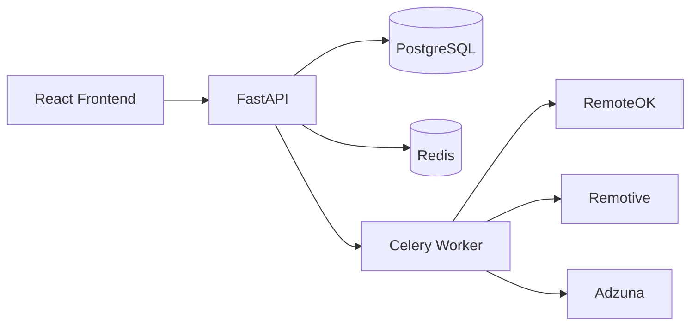

# JobRadar - AI-Powered Job Aggregator & Skill Match Engine


## What it does
JobRadar continuously aggregates software job listings from multiple external sources into a unified feed and scores each role against a user resume. It helps candidates prioritize the highest-fit opportunities first, while showing concrete skill gaps for targeted upskilling.

## How the skill match works
JobRadar first converts resume text and job descriptions into TF-IDF vectors so both are represented in a consistent mathematical space. It then measures cosine similarity to estimate how semantically close a role is to the resume. A keyword boost is applied when exact high-value skills overlap, which helps reward practical tool alignment beyond pure vector similarity. The final score is capped to a 0-100 range and returned with matched and missing skills for explainability.

## Architecture


## Local setup
```bash
git clone https://github.com/nishant2-1/Real-Time-Job-Board-Aggregator-with-Skill-Match-Engine.git
cd Real-Time-Job-Board-Aggregator-with-Skill-Match-Engine/jobrador
cp .env.example .env
# Fill ADZUNA_APP_ID, ADZUNA_APP_KEY, and SECRET_KEY in .env
docker compose up --build
```

Open http://localhost:3000 - API docs: http://localhost:8000/docs

## Features
- Multi-source job ingestion via Celery workers (RemoteOK, Remotive, Adzuna)
- Resume parsing for PDF/DOCX with extracted skills, titles, and experience signals
- AI-assisted match scoring with TF-IDF, cosine similarity, and skill boosting
- Real-time dashboard with scraper status, top matches, and skill breakdown charts
- Saved jobs workflow with optimistic UI updates in React Query
- End-to-end containerized local stack with FastAPI, PostgreSQL, Redis, Celery, and React

## Tech stack
| Layer | Technologies |
|---|---|
| Frontend | React 18, TypeScript, Tailwind CSS, React Query, Recharts |
| Backend API | FastAPI, Pydantic, SQLAlchemy, Alembic |
| Async/Workers | Celery, Redis |
| Data | PostgreSQL |
| Resume/ML | PyMuPDF, python-docx, scikit-learn (TF-IDF + cosine) |
| DevOps | Docker, Docker Compose, GitHub Actions |

## License
MIT

