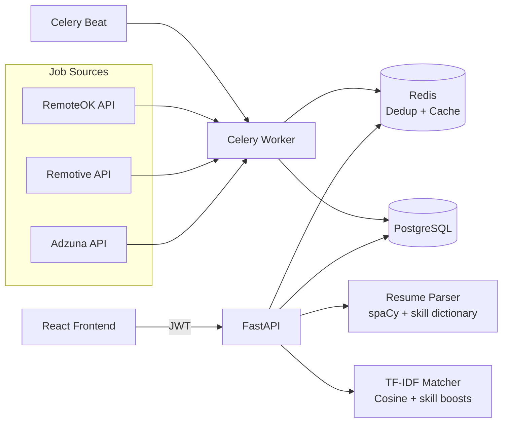

# JobRadar - Real-Time Job Board Aggregator with Skill-Match Engine

JobRadar is a production-grade personal job search engine for software professionals. It continuously ingests listings from multiple public job boards, normalizes and deduplicates jobs, parses candidate resumes, and computes a skill-match score so users can focus on the highest-fit opportunities first.

## Tech Stack


## Who This Is For

- Engineers actively job searching who want ranked, high-relevance results.
- Career switchers who need visibility into missing skills for target roles.
- Recruiters and staffing teams that need normalized multi-source listings.

## Architecture



## Core Capabilities

- Async multi-source scraping with retry/backoff and rotating user agents.
- Redis deduplication using title + company + location hash keys.
- Resume parsing for PDF and DOCX with skill and experience extraction.
- TF-IDF + cosine matching with exact-skill boost and missing-skill output.
- JWT auth with access/refresh token flow.
- Pagination-ready API responses for list endpoints.

## Local Setup

1. Clone and enter the repository.
2. Create environment file from template.
3. Start full stack with Docker Compose.

```bash
cp .env.example .env
docker compose up --build
```

### macOS one-shot setup

If you want a direct bootstrap script for macOS:

```bash
chmod +x scripts/setup-macos.sh
./scripts/setup-macos.sh
```

Services:
- Backend API: http://localhost:8000
- API docs: http://localhost:8000/docs
- Frontend: http://localhost:5173

## API Documentation

- OpenAPI Swagger UI: http://localhost:8000/docs
- ReDoc: http://localhost:8000/redoc

## How Skill Match Works

1. Resume text and each job description are transformed with TF-IDF vectors.
2. Cosine similarity is computed and scaled to a 0-100 base score.
3. Exact keyword overlaps (for example React, Docker, FastAPI) apply a bounded positive boost.
4. Engine returns:
- Match score (%)
- Top matched skills
- Top missing skills
5. Score payloads are cached in Redis for one hour to reduce recomputation.

In formula form:

$$
	ext{final\_score} = \min\left(100,\ 100 \cdot \cos(\vec{r}, \vec{j}) + \text{skill\_boost}\right)
$$

## CI/CD

GitHub Actions workflow runs on push and pull request:
- Backend: Ruff, Mypy, Pytest with coverage gate.
- Frontend: ESLint, TypeScript check, Jest.
- Main branch only: Docker image build and push to Docker Hub.

## Screenshots

- Dashboard (placeholder)
- Jobs list (placeholder)
- Resume upload and parsed profile (placeholder)

## Repository Layout

See project tree under:
- backend: API, models, services, tasks, tests, migrations
- frontend: React app, hooks, pages, components, services
- .github/workflows: CI/CD pipeline

