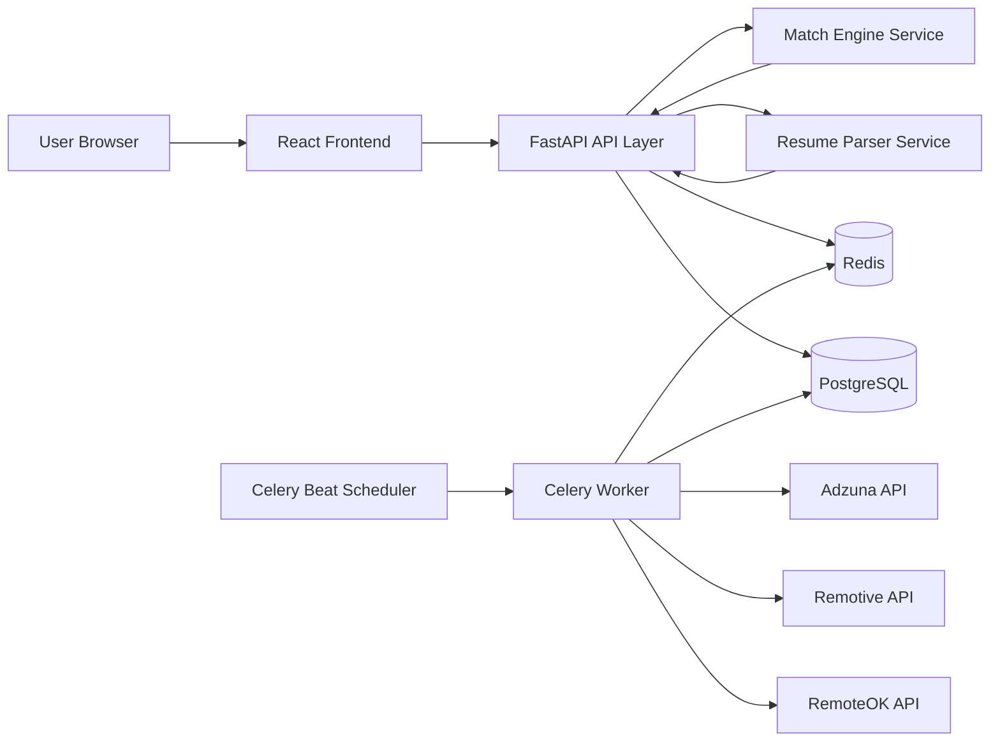

# JobRadar - Real-Time Job Aggregator with Resume Skill Match Intelligence


## Overview
JobRadar is a full-stack job discovery platform that automates job search and ranking.

Instead of manually checking multiple sites every day, JobRadar:
- Aggregates jobs from RemoteOK, Remotive, and Adzuna
- Removes duplicates with Redis fingerprinting
- Parses uploaded resumes (PDF or DOCX)
- Computes a skill-match score for each job using NLP
- Presents ranked opportunities in a responsive React dashboard

In one line: JobRadar acts like a personal job search engine that continuously finds, deduplicates, and ranks opportunities by your profile fit.

## Core System Components

### 1) Scraper Engine (Background Ingestion)
- Scheduled with Celery Beat every 30 minutes
- Fetches jobs from external providers using HTTP clients
- Normalizes heterogeneous payloads into a common schema
- Stores job fingerprints in Redis to avoid duplicates
- Persists clean job records in PostgreSQL

Interview summary:
Built an async scraping pipeline with Celery scheduling and Redis hash-based deduplication across three external job sources.

### 2) Resume Parser (Unstructured to Structured Data)
- Accepts PDF and DOCX uploads
- Extracts text with PyMuPDF and python-docx
- Uses spaCy plus regex heuristics to identify:
  - skills
  - role titles
  - education indicators
  - experience cues

Interview summary:
Converted unstructured resume documents into structured candidate features using NLP and rule-based extraction.

### 3) Skill-Match Engine (Ranking Intelligence)
- Vectorizes resume text and job descriptions with TF-IDF
- Computes cosine similarity between vectors
- Applies keyword overlap boosts for explicit skill matches
- Returns normalized score in 0-100 range
- Caches score lookups in Redis for faster repeat responses

Interview summary:
Implemented a TF-IDF plus cosine similarity matcher with deterministic skill boosting and Redis-backed result caching.

### 4) FastAPI Backend (Platform Control Plane)
- JWT-based registration and login
- Resume upload and profile endpoints
- Job listing endpoints with filter and sort controls
- Scraper trigger and status endpoints
- Rate limiting, request ID tracing, and structured logging
- OpenAPI docs automatically available at /docs

Interview summary:
Developed a production-style FastAPI service with authentication, observability, and guarded API traffic.

### 5) React Frontend (User Experience Layer)
- React 18, TypeScript, Tailwind CSS
- Dashboard for activity and match analytics
- Jobs view with filters and save actions
- Resume upload and editable parsed metadata
- React Query data caching and loading/error states

Interview summary:
Built a type-safe React application with query caching, reusable hooks, and responsive workflows for job discovery.

## System Architecture



## System Design Notes

### Data Flow
1. Celery Beat triggers scheduled scraping tasks.
2. Worker fetches and normalizes external jobs.
3. Redis fingerprint check prevents duplicate inserts.
4. Unique jobs are written to PostgreSQL.
5. User uploads resume through frontend.
6. Backend parses resume and stores structured profile data.
7. Match engine computes score between resume and jobs.
8. Ranked jobs are returned via API and rendered by frontend.

### Scalability and Reliability Decisions
- Asynchronous background jobs isolate scraping load from API latency.
- Redis provides low-latency deduplication and score caching.
- PostgreSQL stores normalized, queryable job and user entities.
- Containerized services simplify local parity and deployment workflows.
- API rate limits and structured logs improve operational safety and debugging.

### Security and Observability
- JWT access and refresh token model
- Request-level tracing with request IDs
- Structured JSON-style logging for troubleshooting
- Input validation with Pydantic schemas

## Tech Stack

| Layer | Technology | Why |
|---|---|---|
| Frontend | React 18, TypeScript, Tailwind CSS, React Query | Type-safe UI with strong state and data handling |
| Backend API | FastAPI, Pydantic, SQLAlchemy, Alembic | High-performance API with validation and schema migrations |
| Background Tasks | Celery, Redis | Scheduled and asynchronous processing |
| Database | PostgreSQL | Relational consistency and robust querying |
| NLP and Matching | spaCy, scikit-learn, PyMuPDF, python-docx | Resume parsing and vector-based relevance scoring |
| DevOps | Docker, Docker Compose, GitHub Actions | Repeatable environments and CI pipelines |

## Quick Start (Docker)

```bash
git clone https://github.com/nishant2-1/Real-Time-Job-Board-Aggregator-with-Skill-Match-Engine.git
cd Real-Time-Job-Board-Aggregator-with-Skill-Match-Engine/jobrador
cp .env.example .env
docker compose up --build
```

Access points:
- Frontend: http://localhost:3000
- Backend API: http://localhost:8000
- API Docs: http://localhost:8000/docs

## What You Need To Run This Project

### Required services
- Docker Desktop if you want the easiest full-stack startup path
- Or, if running without Docker:
  - PostgreSQL
  - Redis
  - Python 3.11+
  - Node.js 18+

### Required configuration
- `POSTGRES_HOST`, `POSTGRES_PORT`, `POSTGRES_DB`, `POSTGRES_USER`, `POSTGRES_PASSWORD`
  - Needed so FastAPI, Alembic, and SQLAlchemy can connect to the database.
- `REDIS_HOST`, `REDIS_PORT`, `REDIS_DB`
  - Needed for Celery, cache storage, and job deduplication.
- `JWT_SECRET_KEY`, `JWT_REFRESH_SECRET_KEY`
  - Needed for access and refresh token signing.
- `VITE_API_URL`
  - Needed so the frontend knows where the backend API is running.

### Optional configuration
- `ADZUNA_APP_ID`, `ADZUNA_APP_KEY`
  - Optional but recommended.
  - Without these, scraping still works from RemoteOK and Remotive.
  - Get them from https://developer.adzuna.com/
- `ADMIN_EMAILS`
  - Optional. Used for admin-only scraper actions.
- `DOCKER_HUB_USERNAME`
  - Only needed if you use image publishing in CI.

### How to create the missing values
- JWT secrets:
```bash
openssl rand -hex 32
openssl rand -hex 32
```
- Adzuna credentials:
  - Create an account on Adzuna Developer
  - Create an application
  - Copy the generated `app_id` and `app_key` into `.env`

### Where to put them
1. Copy [jobrador/.env.example](jobrador/.env.example) to `.env`
2. Fill in the values for your environment
3. If you run locally without Docker, set:
   - `POSTGRES_HOST=localhost`
   - `REDIS_HOST=localhost`
   - `CELERY_BROKER_URL=redis://localhost:6379/0`
   - `CELERY_RESULT_BACKEND=redis://localhost:6379/1`
4. If you run with Docker Compose, keep:
   - `POSTGRES_HOST=postgres`
   - `REDIS_HOST=redis`
   - `CELERY_BROKER_URL=redis://redis:6379/0`
   - `CELERY_RESULT_BACKEND=redis://redis:6379/1`

### Minimum working setup
If you only want the app running end-to-end for development, the minimum is:
- PostgreSQL running
- Redis running
- JWT secrets set
- `VITE_API_URL=http://localhost:8000`

Adzuna keys are not mandatory for the application to start.

## Local Development (Without Docker)

Prerequisites:
- Python 3.11+
- Node.js 18+
- PostgreSQL
- Redis

Backend:
```bash
cd backend
python -m venv .venv
source .venv/bin/activate
pip install -r requirements.txt
python -m alembic upgrade head
python -m uvicorn app.main:app --host 0.0.0.0 --port 8000 --reload
```

Frontend:
```bash
cd frontend
npm install
npm run dev
```

## API Surface (High-Level)
- POST /auth/register
- POST /auth/login
- POST /auth/refresh
- GET /jobs
- POST /resume/upload
- GET /resume/me
- PATCH /resume/me
- GET /scraper/status
- POST /scraper/trigger

See complete interactive schema at /docs.

## Suggested Interview Pitch
JobRadar is a full-stack job aggregation and ranking platform that ingests postings from multiple sources, parses resume content with NLP, and computes skill-match scores using TF-IDF cosine similarity, all delivered through a FastAPI plus React architecture with Redis, PostgreSQL, and Dockerized CI workflows.

## Roadmap Ideas
- Source-specific relevance tuning and confidence weighting
- Personalized recommendation feedback loops
- Alerting pipeline for newly discovered high-match jobs
- Role-based access controls and admin analytics views

## License
MIT

