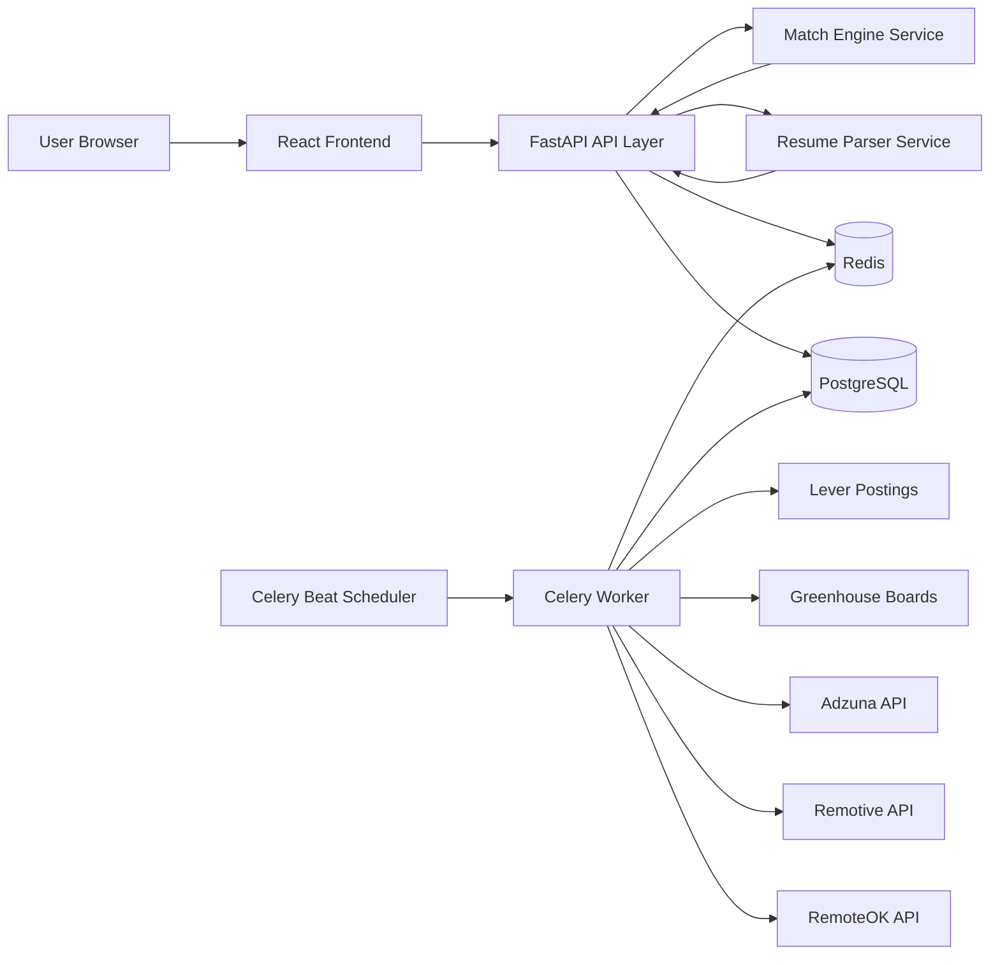

# JobRadar — Real-Time Job Aggregator with Resume Skill Match Intelligence

<div align="center">

[](https://github.com/nishant2-1/Real-Time-Job-Board-Aggregator-with-Skill-Match-Engine/stargazers)
[](https://github.com/nishant2-1/Real-Time-Job-Board-Aggregator-with-Skill-Match-Engine/network/members)
[](https://github.com/nishant2-1/Real-Time-Job-Board-Aggregator-with-Skill-Match-Engine/issues)
[](https://github.com/nishant2-1/Real-Time-Job-Board-Aggregator-with-Skill-Match-Engine/commits/main)
[](LICENSE)

</div>

<div align="center">


</div>

<div align="center">

**Your personal job search engine — continuously finds, deduplicates, and ranks opportunities by your skill profile.**

[](https://render.com/deploy?repo=https://github.com/nishant2-1/Real-Time-Job-Board-Aggregator-with-Skill-Match-Engine)

</div>

---

## Table of Contents

- [Overview](#overview)
- [✨ Features](#-features)
- [System Architecture](#system-architecture)
- [Core System Components](#core-system-components)
- [System Design Notes](#system-design-notes)
- [Tech Stack](#tech-stack)
- [Quick Start (Docker)](#quick-start-docker)
- [What You Need To Run This Project](#what-you-need-to-run-this-project)
- [Local Development (Without Docker)](#local-development-without-docker)
- [Where Data Is Stored](#where-data-is-stored)
- [Deploy Without Docker](#deploy-without-docker)
- [🤝 Contributing](#-contributing)
- [⭐ Show Your Support](#-show-your-support)
- [📝 License](#-license)

---

## Overview

JobRadar is a full-stack job discovery platform that automates job search and ranking.

Instead of manually checking multiple sites every day, JobRadar:

- Aggregates jobs from RemoteOK, Remotive, Adzuna, and direct ATS feeds.
- Removes duplicates with Redis fingerprinting.
- Parses uploaded resumes in PDF or DOCX format.
- Computes a skill-match score for each job using NLP.
- Presents ranked opportunities in a responsive React dashboard.

---

## ✨ Features

| Feature | Description |
|---|---|
| 🔍 **Multi-Source Aggregation** | Pulls jobs from RemoteOK, Remotive, Adzuna, Greenhouse, and Lever ATS in real time |
| 🧠 **AI Skill Matching** | TF-IDF + cosine similarity ranks jobs 0–100 against your resume with keyword boosts |
| 📄 **Resume Parsing** | Upload PDF or DOCX; spaCy + regex extracts skills, roles, education, and experience |
| 🔄 **Deduplication** | Redis fingerprinting prevents the same job appearing twice across sources |
| ⏰ **Auto-Refresh** | Celery Beat scrapes sources every 30 minutes without any manual action |
| 🔒 **Secure Auth** | JWT access + refresh token model with hashed passwords |
| 💾 **Save Jobs** | Bookmark roles and return to them from your personal saved-jobs list |
| 📊 **Analytics Dashboard** | Activity summary and match score insights at a glance |
| 🐳 **One-Command Docker Setup** | Full stack (API, workers, DB, cache, frontend) runs with a single command |
| 📡 **OpenAPI Docs** | Interactive Swagger UI auto-generated at `/docs` |

---

## System Architecture


```mermaid
flowchart LR
  U[User Browser] --> FE[React Frontend]
  FE --> API[FastAPI API Layer]

  API --> PG[(PostgreSQL)]
  API --> RD[(Redis)]

  CB[Celery Beat Scheduler] --> CW[Celery Worker]
  CW --> ROK[RemoteOK API]
  CW --> REM[Remotive API]
  CW --> ADZ[Adzuna API]
  CW --> GHS[Greenhouse Boards]
  CW --> LVR[Lever Postings]

  CW --> PG
  CW --> RD

  API --> RS[Resume Parser Service]
  API --> MM[Match Engine Service]
  RS --> API
  MM --> API
```

## Core System Components

### 1) Scraper Engine (Background Ingestion)

- Scheduled with Celery Beat every 30 minutes.
- Fetches jobs from external providers using HTTP clients.
- Normalizes heterogeneous payloads into a common schema.
- Stores job fingerprints in Redis to avoid duplicates.
- Persists clean job records in PostgreSQL.

### 2) Resume Parser (Unstructured to Structured Data)

- Accepts PDF and DOCX uploads.
- Extracts text with PyMuPDF and python-docx.
- Uses spaCy plus regex heuristics to identify skills, role titles, education indicators, and experience cues.

### 3) Skill-Match Engine (Ranking Intelligence)

- Vectorizes resume text and job descriptions with TF-IDF.
- Computes cosine similarity between vectors.
- Applies keyword overlap boosts for explicit skill matches.
- Returns normalized scores in the 0–100 range.
- Caches score lookups in Redis for faster repeat responses.

### 4) FastAPI Backend (Platform Control Plane)

- JWT-based registration and login.
- Resume upload and profile endpoints.
- Job listing endpoints with filter and sort controls.
- Scraper trigger and status endpoints.
- Rate limiting, request ID tracing, and structured logging.
- OpenAPI docs automatically available at `/docs`.

### 5) React Frontend (User Experience Layer)

- React 18, TypeScript, Tailwind CSS.
- Dashboard for activity and match analytics.
- Jobs view with filters, direct-feed lanes, and save actions.
- Resume upload and editable parsed metadata.
- React Query data caching and loading or error states.

## System Design Notes

### Data Flow

1. Celery Beat triggers scheduled scraping tasks.
2. Workers fetch and normalize external jobs.
3. Redis fingerprint checks prevent duplicate inserts.
4. Unique jobs are written to PostgreSQL.
5. Users upload resumes through the frontend.
6. The backend parses resumes and stores structured profile data.
7. The match engine computes scores between resumes and jobs.
8. Ranked jobs are returned via API and rendered by the frontend.

### Scalability and Reliability Decisions

- Asynchronous background jobs isolate scraping load from API latency.
- Redis provides low-latency deduplication and score caching.
- PostgreSQL stores normalized, queryable job and user entities.
- Containerized services simplify local parity and deployment workflows.
- API rate limits and structured logs improve operational safety and debugging.

### Security and Observability

- JWT access and refresh token model.
- Request-level tracing with request IDs.
- Structured logging for troubleshooting.
- Input validation with Pydantic schemas.

## Tech Stack

| Layer | Technology | Why |
| --- | --- | --- |
| Frontend | React 18, TypeScript, Tailwind CSS, React Query | Type-safe UI with strong state and data handling |
| Backend API | FastAPI, Pydantic, SQLAlchemy, Alembic | High-performance API with validation and schema migrations |
| Background Tasks | Celery, Redis | Scheduled and asynchronous processing |
| Database | PostgreSQL | Relational consistency and robust querying |
| NLP and Matching | spaCy, scikit-learn, PyMuPDF, python-docx | Resume parsing and vector-based relevance scoring |
| DevOps | Docker, Docker Compose, GitHub Actions | Repeatable environments and CI pipelines |

## Quick Start (Docker)

> **Prerequisites:** [Docker Desktop](https://www.docker.com/products/docker-desktop/) must be running.

```bash
git clone https://github.com/nishant2-1/Real-Time-Job-Board-Aggregator-with-Skill-Match-Engine.git
cd Real-Time-Job-Board-Aggregator-with-Skill-Match-Engine
cp .env.example .env
docker compose up --build
```

Access points:

| Service | URL |
|---|---|
| Frontend | http://localhost:3000 |
| Backend API | http://localhost:8000 |
| API Docs (Swagger) | http://localhost:8000/docs |

## What You Need To Run This Project

### Required Services

- Docker Desktop if you want the easiest full-stack startup path.
- Or, if running without Docker:
  - PostgreSQL
  - Redis
  - Python 3.11+
  - Node.js 18+

### Required Configuration

- `POSTGRES_HOST`, `POSTGRES_PORT`, `POSTGRES_DB`, `POSTGRES_USER`, `POSTGRES_PASSWORD`
  - Needed so FastAPI, Alembic, and SQLAlchemy can connect to the database.
- `REDIS_HOST`, `REDIS_PORT`, `REDIS_DB`
  - Needed for Celery, cache storage, and job deduplication.
- `JWT_SECRET_KEY`, `JWT_REFRESH_SECRET_KEY`
  - Needed for access and refresh token signing.
- `VITE_API_URL`
  - Needed so the frontend knows where the backend API is running.

### Optional Configuration

- `ADZUNA_APP_ID`, `ADZUNA_APP_KEY`
  - Optional but recommended.
  - Without these, scraping still works from RemoteOK and Remotive.
  - Get them from [Adzuna Developer](https://developer.adzuna.com/).
- `GREENHOUSE_BOARDS`, `LEVER_COMPANIES`
  - Optional direct ATS board identifiers.
  - Use comma-separated company or board tokens.
- `ADMIN_EMAILS`
  - Optional. Used for admin-only scraper actions.
- `DOCKER_HUB_USERNAME`
  - Only needed if you use image publishing in CI.

### How To Create the Missing Values

JWT secrets:

```bash
openssl rand -hex 32
openssl rand -hex 32
```

Adzuna credentials:

- Create an account on Adzuna Developer.
- Create an application.
- Copy the generated `app_id` and `app_key` into `.env`.

### Where To Put Them

1. Copy `.env.example` to `.env`.
2. Fill in the values for your environment.
3. If you run locally without Docker, set:
   - `POSTGRES_HOST=localhost`
   - `REDIS_HOST=localhost`
   - `CELERY_BROKER_URL=redis://localhost:6379/0`
   - `CELERY_RESULT_BACKEND=redis://localhost:6379/1`
4. If you run with Docker Compose, keep:
   - `POSTGRES_HOST=postgres`
   - `REDIS_HOST=redis`
   - `CELERY_BROKER_URL=redis://redis:6379/0`
   - `CELERY_RESULT_BACKEND=redis://redis:6379/1`

### Minimum Working Setup

If you only want the app running end-to-end for development, the minimum is:

- PostgreSQL running.
- Redis running.
- JWT secrets set.
- `VITE_API_URL=http://localhost:8000`.

Adzuna keys are not mandatory for the application to start.

## Local Development (Without Docker)

Prerequisites:

- Python 3.11+
- Node.js 18+
- PostgreSQL
- Redis

Backend:

```bash
cd backend
python -m venv .venv
source .venv/bin/activate
pip install -r requirements.txt
python -m spacy download en_core_web_sm
python -m alembic upgrade head
python -m uvicorn app.main:app --host 0.0.0.0 --port 8000 --reload
```

Celery worker (separate terminal):

```bash
cd backend
source .venv/bin/activate
celery -A app.tasks.celery_app.celery_app worker --loglevel=info
```

Frontend (separate terminal):

```bash
cd frontend
npm install
npm run dev
```

## Where Data Is Stored

- Registered users are stored in PostgreSQL in the `users` table.
- Uploaded resume text and parsed metadata are stored in PostgreSQL in the `resumes` table.
- Normalized job postings are stored in PostgreSQL in the `jobs` table.
- Saved job relationships are stored in PostgreSQL in the `saved_jobs` table.
- Scraper execution history is stored in PostgreSQL in the `scraper_runs` table.
- Redis stores cache, deduplication keys, and Celery queue state.

Passwords are not stored in plain text. The backend stores only hashed passwords.

## Deploy Without Docker

You do not need Docker on your own machine to deploy JobRadar.

Recommended alternative:

1. Deploy the FastAPI backend to Render or Railway.
2. Provision managed PostgreSQL and Redis on that platform.
3. Run Celery worker and Celery beat as separate background services.
4. Deploy the frontend as a static site with `VITE_API_URL` pointing at the backend.

Backend build command:

```bash
cd backend && pip install -r requirements.txt && python -m spacy download en_core_web_sm
```

Backend start command:

```bash
cd backend && alembic upgrade head && uvicorn app.main:app --host 0.0.0.0 --port $PORT
```

Celery worker command:

```bash
cd backend && celery -A app.tasks.celery_app.celery_app worker --loglevel=info
```

Celery beat command:

```bash
cd backend && celery -A app.tasks.celery_app.celery_app beat --loglevel=info
```

Frontend build command:

```bash
cd frontend && npm ci && npm run build
```

For a fuller handoff explanation, see `scripts/PROJECT_HANDOFF.md`.

For a concrete managed-platform setup, see `RENDER_DEPLOYMENT.md`.

For one-click Render setup from GitHub, use the Deploy to Render button at the top of this README. The repo includes `render.yaml` at the root for that flow.

---

## 🤝 Contributing

Contributions are what make the open-source community such an amazing place to learn, inspire, and create. **Any contributions you make are greatly appreciated!**

1. **Fork** the repository.
2. **Create** your feature branch: `git checkout -b feature/amazing-feature`
3. **Commit** your changes: `git commit -m 'Add some amazing feature'`
4. **Push** to the branch: `git push origin feature/amazing-feature`
5. **Open a Pull Request**.

Please read [CONTRIBUTING.md](CONTRIBUTING.md) for details on our code of conduct and the process for submitting pull requests.

Looking for a place to start? Check out issues labeled [`good first issue`](https://github.com/nishant2-1/Real-Time-Job-Board-Aggregator-with-Skill-Match-Engine/issues?q=is%3Aissue+is%3Aopen+label%3A%22good+first+issue%22) or [`help wanted`](https://github.com/nishant2-1/Real-Time-Job-Board-Aggregator-with-Skill-Match-Engine/issues?q=is%3Aissue+is%3Aopen+label%3A%22help+wanted%22).

---

## ⭐ Show Your Support

If JobRadar helped you or you find it interesting, please consider giving it a ⭐ star — it helps others discover the project and motivates continued development!

[](https://github.com/nishant2-1/Real-Time-Job-Board-Aggregator-with-Skill-Match-Engine/stargazers)

---

## 📝 License

This project is licensed under the [MIT License](LICENSE). Feel free to use, modify, and distribute it.
